# Bamazon CLI

<!-- [](http://hits.dwyl.io/defiledspec/bamazon-cli) -->

Bamazon is an 'amazon like' storefront on the command line, written in node and using mySQL for data storage.


## Getting Started

### Requirements

* node.js

* mySQL Server

* mySQL Workbench

## Setup

First clone the repo using *bash*.

 ```bash
 git clone https://github.com/DefiledSpec/bamazon-cli.git
 ```

Cd into the directory and install the required dependencies.

 ```bash
 cd bamazon-cli/ && npm install
 ```

Open mySQL Workbench and connect to your local mySQL Server.

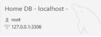

Copy the contents of `bamzon.sql` provided in the bamazon-cli folder into your mySQL Workbench and run the script by clicking this button .

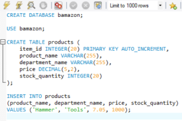

Finally in `BamazonDB.js` confirm that the `user`, `password`, and `host` fields are correct for your own database connection.

```js
this.db = mysql.createPool({
    connectionLimit: 10,
    host: '127.0.0.1', // localhost
    user: 'root',
    password: 'root',
    database: 'bamazon'
})
```

## Usage

\* Please note that to view items you must add them first using the Manager CLI. \*

## Customer CLI

---

To use Bamazon as a customer run `node bamazonCust.js` in *bash*.

  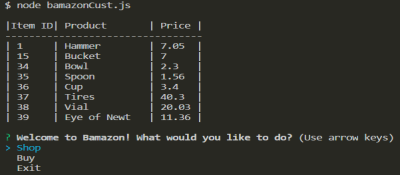

Select one of the options provided.

### Shop

* Displays a list of all items currently in stock.

  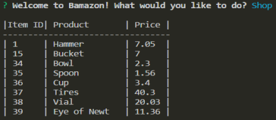

### Buy

1. Returns a list of items avaliable for purchase.

   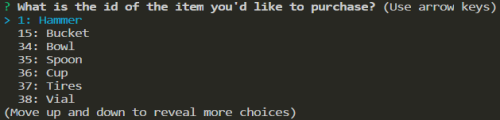

2. Prompts the user to enter a quantity.

   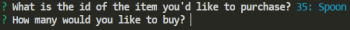
  
* If the store has enough of the item, the order is fulfuilled.

   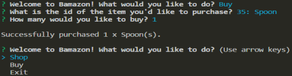
  
* However if the store doesn't have enought than the order is rejcted and the user is notified.

   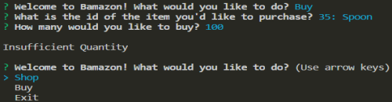

### Exit

* Closes the Bamazon Customer CLI.

## Manager CLI

---

To use Bamazon as a manager run `node bamazonManager.js` in *bash*.

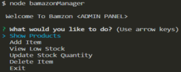

Select one of the options provided.

### Show Products

* Displays a list of all the poducts in the database.

   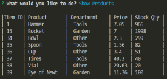

### Add Item

1. Prompts the user for the new items' *name*.

   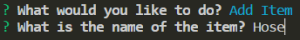

2. Prompts the user to select from a list of *departments*.

   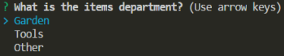

3. Prompts the user to enter the *sale price* of the item.

   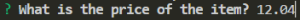

4. Prompts the user for the amount of that item in *stock*.

   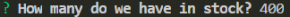

* Finally the user is prompted asking if they would like to *add another* item.

  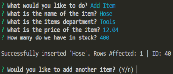

### View Low Stock
  
* Returns a list of items in the store that have a *stock less than 5*.

  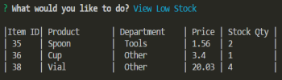

### Update Stock Quantity

1. Prompts the user to *select an item* from the list.

   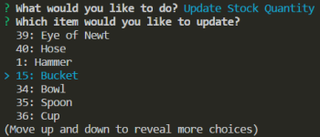

2. Prompts the user to input how many of that item to add to *stock*

   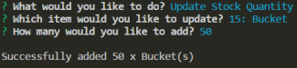

* Delete Item (Extra Feature for Dev)

1. Prompts the user to input the id of the item they would like to delete.

   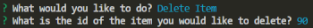

* If that item exists, it is *deleted* from the database.

   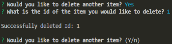

* If the item doesnt exits, the user is notified and *nothing happens* on the backend.

   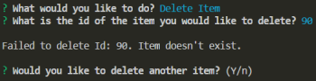

* Exit
  
  * Closes the Bamazon Manager CLI.